# 🎨 How to Visualize Your LangGraph Agent

## ✅ Graph Generated!

Your agent's workflow graph has been saved to:
- **Mermaid file:** `agent_graph.mmd`
- **PNG image:** `agent_graph.png` (if graphviz is installed)

---

## 📊 Option 1: View Online (Easiest!)

1. **Open** https://mermaid.live/
2. **Copy** the content from `agent_graph.mmd`
3. **Paste** into the left panel
4. **See** the interactive graph on the right!

**Your Mermaid Code:**


---

## 📊 Option 2: VS Code Extension

1. **Install** the "Markdown Preview Mermaid Support" extension
2. **Open** `agent_graph.mmd` in VS Code
3. **Press** `Ctrl+Shift+V` (or `Cmd+Shift+V` on Mac) to preview

---

## 📊 Option 3: View PNG Image

If the PNG was generated, simply open `agent_graph.png` in any image viewer!

---

## 🔍 What the Graph Shows

### Nodes (Boxes):
- **__start__**: Entry point
- **analyze_query**: LLM analyzes the query
- **sql_filter**: Filters candidates using SQL
- **llm_sql_generation**: LLM generates SQL if needed
- **vector_search**: Semantic search in vector DB
- **enrich_results**: Fetch full resume data
- **generate_answer**: LLM generates natural language answer
- **__end__**: Exit point

### Edges (Arrows):
- **Solid arrows** (→): Normal flow
- **Dotted arrows** (⋯→): Conditional flow
  - `retry`: Goes back to sql_filter if no results
  - `end`: Exits if results found

### Flow:
```
START 
  → Analyze Query 
  → SQL Filter 
  → LLM SQL Generation (if needed)
  → Vector Search 
  → Enrich Results 
  → Generate Answer
  → END (or retry back to SQL Filter)
```

---

## 🎯 Understanding the Retry Loop

Notice the **dotted arrow** from `generate_answer` back to `sql_filter`?

This is the **retry mechanism**:
1. If `generate_answer` finds no results
2. It goes back to `sql_filter` with a different strategy
3. Tries again with LLM-generated SQL or vector-first approach
4. Maximum 1 retry attempt

---

## 🚀 Advanced: Generate PNG Programmatically

To generate PNG images, install graphviz:

```bash
# Windows (using Chocolatey)
choco install graphviz

# Or download from: https://graphviz.org/download/

# Then install Python package
pip install pygraphviz
```

Then run `python scripts/visualize_graph.py` again!

---

## 📝 Customizing the Visualization

You can modify the graph appearance by editing the Mermaid code:

```mermaid
graph TD;
    analyze_query[🧠 Analyze Query]
    sql_filter[📊 SQL Filter]
    vector_search[🔍 Vector Search]
    
    analyze_query --> sql_filter
    sql_filter --> vector_search
    
    style analyze_query fill:#e1f5ff
    style sql_filter fill:#fff4e1
    style vector_search fill:#ffe1f5
```



---

## 🎨 Color Coding in Current Graph

- **Purple (#f2f0ff)**: Default nodes
- **Transparent**: Start node
- **Dark purple (#bfb6fc)**: End node

You can customize these in the `classDef` section!
