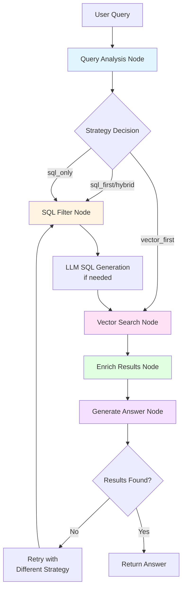
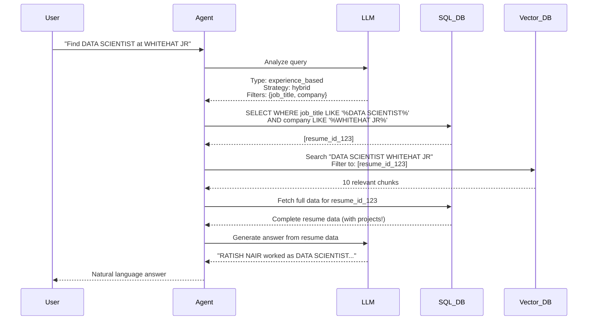
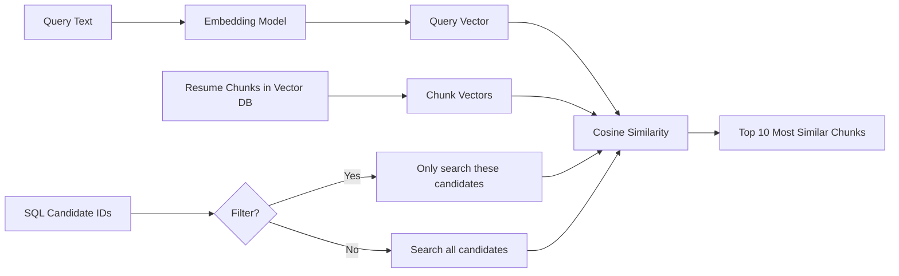
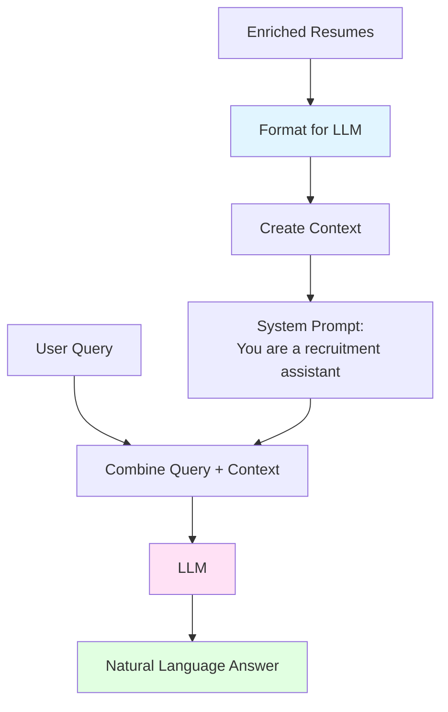
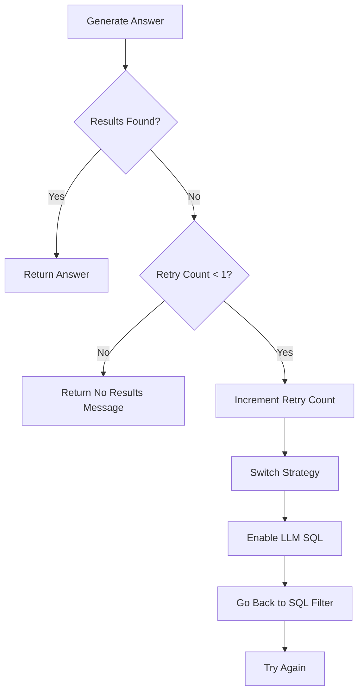

# 🧠 Intelligent Agent Deep Dive Guide

A comprehensive guide to understanding the Resume Intelligence Agent architecture and implementation.

---

## 📋 Table of Contents

1. [Overview](#overview)
2. [Architecture Diagram](#architecture-diagram)
3. [Core Concepts](#core-concepts)
4. [Detailed Component Breakdown](#detailed-component-breakdown)
5. [Workflow Execution](#workflow-execution)
6. [Advanced Features](#advanced-features)
7. [Examples & Use Cases](#examples--use-cases)

---

## Overview

### What is the Intelligent Agent?

The **Resume Intelligence Agent** is an AI-powered system that automatically analyzes user queries about resumes and intelligently decides the best strategy to find answers. Think of it as a smart assistant that:

1. **Understands** what you're asking
2. **Plans** the best way to search
3. **Executes** the search efficiently
4. **Generates** natural language answers

### Why is it "Intelligent"?

Unlike a simple search system that always does the same thing, this agent:
- ✅ **Adapts** its strategy based on the query type
- ✅ **Combines** SQL (structured) and Vector (semantic) search
- ✅ **Retries** with different strategies if needed
- ✅ **Optimizes** for performance (crucial with 1000+ candidates)

---

## Architecture Diagram



### Data Flow Visualization



---

## Core Concepts

### 1. State Management

The agent uses a **state dictionary** that flows through all nodes:

```python
class AgentState(TypedDict):
    query: str                    # "Find Python developers"
    query_analysis: dict          # LLM's understanding
    search_strategy: str          # "sql_first", "vector_first", "hybrid", "sql_only"
    sql_filters: dict             # {min_experience: 5, location: "India"}
    candidate_ids: list           # [id1, id2, id3] from SQL
    search_results: list          # Raw vector search results
    final_results: list           # Enriched resume data
    answer: str                   # Generated answer
    should_retry: bool            # Retry flag
```

**Why use state?**
- Each node can read and modify the state
- State persists across the entire workflow
- Easy to debug (you can see state at each step)

### 2. Search Strategies

The agent chooses from 4 strategies:

| Strategy | When to Use | SQL | Vector | Example Query |
|----------|-------------|-----|--------|---------------|
| **sql_first** | Name-based queries | ✅ Filter by name | ✅ Refine results | "Show Shubham's projects" |
| **vector_first** | Semantic/project queries | ❌ Skip | ✅ Semantic search | "Who built RAG systems?" |
| **hybrid** | Multi-criteria | ✅ Filter experience/location | ✅ Semantic skills | "Python devs with 5+ years" |
| **sql_only** | Simple structured | ✅ Only SQL | ❌ Skip | "Candidates with 10+ years" |

### 3. LangGraph Workflow

The agent uses **LangGraph** to create a state machine:

```python
workflow = StateGraph(AgentState)

# Add nodes (functions that process state)
workflow.add_node("analyze_query", analyze_query_node)
workflow.add_node("sql_filter", sql_filter_node)
workflow.add_node("vector_search", vector_search_node)

# Define flow
workflow.set_entry_point("analyze_query")
workflow.add_edge("analyze_query", "sql_filter")
workflow.add_edge("sql_filter", "vector_search")

# Conditional retry
workflow.add_conditional_edges(
    "generate_answer",
    should_retry_node,
    {"retry": "sql_filter", "end": END}
)
```

---

## Detailed Component Breakdown

### Part 1: Query Analysis Node 🧠

**Purpose:** Understand what the user wants and plan the search strategy.

```python
def analyze_query_node(state: AgentState) -> AgentState:
    """
    Analyzes user query using LLM to extract:
    - Query type (name_based, skill_based, etc.)
    - Entities (names, skills, companies)
    - Filters (experience, location)
    - Best search strategy
    """
```

#### The QueryAnalysis Model (CRITICAL!)

This is the **brain's output format** - a Pydantic model that structures the LLM's understanding:

```python
class QueryAnalysis(BaseModel):
    """Structured output from query analyzer"""
    
    # 1. QUERY TYPE - What kind of question is this?
    query_type: Literal[
        "name_based",              # "Show Shubham's projects"
        "skill_based",             # "Find Python developers"
        "experience_based",        # "Candidates with 10+ years"
        "project_based",           # "Who built RAG systems?"
        "education_based",         # "Find PhDs in ML"
        "location_based",          # "Candidates in India"
        "complex_multi_criteria"   # "Python devs in India with 5+ years"
    ] = Field(description="Primary type of the query")
    
    # 2. INTENT - What does the user want?
    intent: str = Field(
        description="What the user wants to know (e.g., 'find candidates', 'get education details', 'compare candidates')"
    )
    # Examples:
    # - "find candidates matching criteria"
    # - "get specific information about a candidate"
    # - "compare multiple candidates"
    # - "list all projects of a candidate"
    
    # 3. ENTITIES - Extracted nouns/concepts
    entities: dict = Field(
        description="Extracted entities: names, skills, companies, locations, degrees, etc."
    )
    # Example:
    # {
    #   "names": ["Shubham Baghel", "RATISH NAIR"],
    #   "skills": ["Python", "Machine Learning"],
    #   "companies": ["WHITEHAT JR", "Google"],
    #   "location": "India"
    # }
    
    # 4. FILTERS - Structured constraints for SQL
    filters: dict = Field(
        description="Structured filters: min_experience, max_experience, location, required_skills, job_title, company, etc."
    )
    # Example:
    # {
    #   "min_experience": 5,
    #   "max_experience": 10,
    #   "location": "Bangalore",
    #   "required_skills": ["Python", "SQL"],
    #   "job_title": "DATA SCIENTIST",
    #   "company": "WHITEHAT JR"
    # }
    
    # 5. SEARCH STRATEGY - How to search?
    search_strategy: Literal[
        "sql_first",      # SQL filter by name/location, then vector search
        "vector_first",   # Semantic search first, no SQL filtering
        "hybrid",         # SQL filters + vector search combined
        "sql_only"        # Only SQL, skip vector search
    ] = Field(description="Recommended search strategy based on query analysis")
    
    # 6. CONFIDENCE - How sure is the LLM?
    confidence: float = Field(
        description="Confidence in the analysis (0.0 to 1.0)",
        ge=0.0,  # Greater than or equal to 0
        le=1.0   # Less than or equal to 1
    )
    # 0.9-1.0: Very confident (clear query)
    # 0.7-0.9: Confident (standard query)
    # 0.5-0.7: Moderate (ambiguous query)
    # <0.5: Low confidence (unclear query)
    
    # 7. REASONING - Why this strategy?
    reasoning: str = Field(
        description="Brief explanation of why this strategy was chosen"
    )
    # Example: "Name-based query with exact match, so sql_first is most efficient"
```

**Why Pydantic?**

1. **Type Safety:** LLM must return exact structure
2. **Validation:** Automatic validation of fields (e.g., confidence must be 0-1)
3. **Documentation:** Field descriptions guide the LLM
4. **Parsing:** Easy to convert LLM output to Python objects

**How LLM Uses This:**

```python
# LLM sees the Pydantic schema and generates JSON matching it
chain = prompt | llm.with_structured_output(QueryAnalysis)

# LLM output (JSON):
{
  "query_type": "experience_based",
  "intent": "find candidate's education",
  "entities": {},
  "filters": {
    "job_title": "DATA SCIENTIST",
    "company": "WHITEHAT JR"
  },
  "search_strategy": "hybrid",
  "confidence": 0.80,
  "reasoning": "Experience-based query needs SQL for job filtering + vector for semantic matching"
}

# Automatically parsed to QueryAnalysis object:
analysis = QueryAnalysis(
    query_type="experience_based",
    intent="find candidate's education",
    entities={},
    filters={"job_title": "DATA SCIENTIST", "company": "WHITEHAT JR"},
    search_strategy="hybrid",
    confidence=0.80,
    reasoning="Experience-based query needs SQL for job filtering + vector for semantic matching"
)

# Now we can use it:
state["search_strategy"] = analysis.search_strategy  # "hybrid"
state["sql_filters"] = analysis.filters  # {"job_title": "DATA SCIENTIST", ...}
```

#### How it Works:

1. **Prompt Engineering:**
   ```python
   analysis_prompt = ChatPromptTemplate.from_messages([
       ("system", """You are a query analyzer...
       Extract:
       - names: ["Shubham Baghel"]
       - job_title: "DATA SCIENTIST"
       - company: "WHITEHAT JR"
       """),
       ("user", "Query: {query}")
   ])
   ```

2. **Structured Output:**
   ```python
   class QueryAnalysis(BaseModel):
       query_type: Literal["name_based", "skill_based", ...]
       entities: dict  # {"names": ["John"], "skills": ["Python"]}
       filters: dict   # {"min_experience": 5, "job_title": "Engineer"}
       search_strategy: Literal["sql_first", "vector_first", ...]
       confidence: float
       reasoning: str
   ```

3. **LLM Invocation:**
   ```python
   chain = analysis_prompt | llm.with_structured_output(QueryAnalysis)
   analysis = chain.invoke({"query": state["query"]})
   ```

#### Example:

**Input Query:** "Find DATA SCIENTIST at WHITEHAT JR"

**LLM Output:**
```json
{
  "query_type": "experience_based",
  "entities": {},
  "filters": {
    "job_title": "DATA SCIENTIST",
    "company": "WHITEHAT JR"
  },
  "search_strategy": "hybrid",
  "confidence": 0.80,
  "reasoning": "Experience-based query needs SQL for job filtering + vector for semantic matching"
}
```

---

### Part 2: SQL Filter Node 📊

**Purpose:** Filter candidates using structured SQL queries for efficiency.

```python
def sql_filter_node(state: AgentState) -> AgentState:
    """
    Builds and executes SQL query based on extracted filters.
    Reduces candidate pool from 17,000 to ~1-10 before vector search.
    """
```

#### SQL Query Building Logic:

```python
where_clauses = []
params = []

# 1. Name filter
if entities.get("names"):
    where_clauses.append("candidate_name LIKE ?")
    params.append(f"%{entities['names'][0]}%")

# 2. Experience filter
if filters.get("min_experience"):
    where_clauses.append("total_experience_years >= ?")
    params.append(filters["min_experience"])

# 3. Location filter
if filters.get("location"):
    where_clauses.append("location LIKE ?")
    params.append(f"%{filters['location']}%")

# 4. Job title filter (NEW!)
if filters.get("job_title"):
    where_clauses.append("(work_experience LIKE ? OR current_role LIKE ?)")
    params.append(f"%{filters['job_title']}%")
    params.append(f"%{filters['job_title']}%")

# 5. Company filter (NEW!)
if filters.get("company"):
    where_clauses.append("work_experience LIKE ?")
    params.append(f"%{filters['company']}%")

# Build final SQL
sql = "SELECT resume_id FROM parsed_resumes"
if where_clauses:
    sql += " WHERE " + " AND ".join(where_clauses)
```

#### Why This Matters:

**Without SQL Filtering:**
```
Query: "DATA SCIENTIST at WHITEHAT JR"
→ Vector search across 17,000 candidates
→ Slow, expensive, memory-intensive
```

**With SQL Filtering:**
```
Query: "DATA SCIENTIST at WHITEHAT JR"
→ SQL filters to 1 candidate (RATISH NAIR)
→ Vector search on 1 candidate only
→ 17,000x faster! 🚀
```

---

### Part 3: LLM SQL Generation Node 🤖

**Purpose:** Fallback mechanism when predefined SQL filters don't work.

```python
def llm_sql_generation_node(state: AgentState) -> AgentState:
    """
    If SQL returns no results, ask LLM to generate custom SQL.
    Useful for complex queries that don't fit standard patterns.
    """
```

#### When It's Triggered:

```python
# In sql_filter_node:
if not candidate_ids and state["search_strategy"] == "sql_only":
    state["use_llm_sql"] = True  # Trigger LLM SQL generation
```

#### How It Works:

1. **Provide Schema to LLM:**
   ```python
   schema_info = """
   Table: parsed_resumes
   Columns:
   - candidate_name (TEXT)
   - total_experience_years (REAL)
   - skills (TEXT) - JSON array
   - work_experience (TEXT) - JSON array
   """
   ```

2. **Ask LLM to Generate SQL:**
   ```python
   prompt = f"""
   Generate SQLite query for: {state["query"]}
   Schema: {schema_info}
   Return ONLY the SQL query.
   """
   
   generated_sql = llm.invoke(prompt).content
   ```

3. **Execute Generated SQL:**
   ```python
   cursor.execute(generated_sql)
   results = cursor.fetchall()
   ```

#### Example:

**Query:** "Find candidates who know both PyTorch and TensorFlow"

**LLM Generates:**
```sql
SELECT resume_id FROM parsed_resumes 
WHERE skills LIKE '%PyTorch%' 
  AND skills LIKE '%TensorFlow%'
```

---

### Part 4: Vector Search Node 🔍

**Purpose:** Semantic search to find relevant resume chunks.

```python
def vector_search_node(state: AgentState) -> AgentState:
    """
    Searches vector database for semantically similar content.
    Can filter to SQL candidates or search all.
    """
```

#### Vector Search Flow:



#### Code Breakdown:

```python
# 1. Check if we should filter to SQL candidates
vector_filters = None
if state["candidate_ids"]:
    # Only search these specific candidates
    vector_filters = {"resume_id": {"$in": state["candidate_ids"]}}
    print(f"Filtering to {len(state['candidate_ids'])} candidates from SQL")

# 2. Execute vector search
from vectorstore.chroma_store import ResumeVectorStore
vector_store = ResumeVectorStore()

results = vector_store.search(
    query=state["query"],           # "DATA SCIENTIST WHITEHAT JR"
    top_k=10,                        # Get top 10 matches
    filters=vector_filters           # Filter to SQL candidates
)

# 3. Results contain:
# - ids: ["resume_123__experience__0", ...]
# - metadatas: [{"resume_id": "123", "chunk_type": "experience"}, ...]
# - documents: ["Work Experience of RATISH NAIR: DATA SCIENTIST at WHITEHAT JR..."]
# - distances: [0.12, 0.34, ...]  (lower = more similar)
```

#### Why Vector Search?

**SQL can't do this:**
```
Query: "Who has experience with transformer architectures?"
→ SQL: Can't understand "transformer architectures" = GPT, BERT, attention mechanisms
→ Vector: Understands semantic similarity, finds GPT-2 projects!
```

**Vector search understands:**
- Synonyms: "ML" = "Machine Learning"
- Related concepts: "RAG" relates to "LangChain", "vector databases"
- Context: "built from scratch" vs "used library"

---

### Part 5: Enrich Results Node 💎

**Purpose:** Deduplicate chunks and fetch complete resume data.

```python
def enrich_results_node(state: AgentState) -> AgentState:
    """
    1. Deduplicate: Same resume may appear in multiple chunks
    2. Fetch full data: Get complete resume from SQLite
    """
```

#### Deduplication Logic:

```python
# Problem: Vector search returns chunks, not resumes
# Same resume can appear multiple times (different chunks)

# Example:
# Chunk 1: "Shubham Baghel: GPT-2 project..." (resume_id: 123)
# Chunk 2: "Shubham Baghel: Stable Diffusion project..." (resume_id: 123)
# Chunk 3: "Shubham Baghel: Work at NIT..." (resume_id: 123)

seen_resumes = {}
for meta, doc, dist in zip(metadatas, documents, distances):
    resume_id = meta.get("resume_id")
    
    # Keep only the best (lowest distance) chunk per resume
    if resume_id not in seen_resumes or dist < seen_resumes[resume_id]["distance"]:
        seen_resumes[resume_id] = {
            "resume_id": resume_id,
            "distance": dist,
            "snippet": doc[:200]
        }

# Result: 10 chunks → 3 unique resumes
```

#### Fetching Full Data:

```python
# Now fetch complete resume data from SQLite
unique_ids = list(seen_resumes.keys())  # [123, 456, 789]

sql = """
    SELECT pr.*, d.raw_text
    FROM parsed_resumes pr
    LEFT JOIN documents d ON pr.document_id = d.document_id
    WHERE pr.resume_id IN (?, ?, ?)
"""

cursor.execute(sql, unique_ids)
rows = cursor.fetchall()

# Each row contains:
# - candidate_name, email, phone, location
# - total_experience_years, current_role
# - skills (JSON), work_experience (JSON), education (JSON)
# - projects (JSON) ← CRITICAL for answering project questions!
# - raw_text (full resume text)
```

---

### Part 6: Generate Answer Node 🤖

**Purpose:** Create natural language answer from enriched resume data.

```python
def generate_answer_node(state: AgentState) -> AgentState:
    """
    Uses LLM to generate human-readable answer from resume data.
    """
```

#### Answer Generation Process:



#### Context Formatting:

```python
def format_resume_for_context(resume_data: dict) -> str:
    """Convert resume data into readable text for LLM"""
    
    parts = []
    
    # 1. Basic info
    parts.append(f"**{resume_data['candidate_name']}**")
    parts.append(f"Current Role: {resume_data['current_role']}")
    parts.append(f"Experience: {resume_data['total_experience_years']} years")
    
    # 2. Skills
    skills = json.loads(resume_data['skills'])
    parts.append(f"Skills: {', '.join(skills)}")
    
    # 3. Work experience
    work = json.loads(resume_data['work_experience'])
    parts.append("\nWork Experience:")
    for job in work[:3]:
        parts.append(f"  • {job['role']} at {job['company']}")
    
    # 4. Education
    edu = json.loads(resume_data['education'])
    parts.append("\nEducation:")
    for degree in edu:
        parts.append(f"  • {degree['degree']} from {degree['institute']}")
    
    # 5. Projects (CRITICAL!)
    projects = json.loads(resume_data['projects'])
    parts.append("\nProjects:")
    for proj in projects:
        parts.append(f"  • {proj['name']}")
        parts.append(f"    Description: {proj['description']}")
        parts.append(f"    Technologies: {', '.join(proj['technologies'])}")
    
    return "\n".join(parts)
```

#### LLM Prompt:

```python
prompt = ChatPromptTemplate.from_messages([
    ("system", """You are a recruitment assistant.
    
    RULES:
    - Answer ONLY from provided resumes
    - NEVER mix up information between candidates
    - If information is missing, say "Not specified"
    - Be specific with names, skills, and experience
    """),
    
    ("user", """Question: {query}
    
    Search Results:
    {context}
    
    Provide a helpful answer.""")
])

answer = llm.invoke({
    "query": "What is the educational background of the DATA SCIENTIST at WHITEHAT JR?",
    "context": formatted_resumes
})
```

#### Example Output:

```
Based on the provided search results, the candidate who worked as a 
DATA SCIENTIST at WHITEHAT JR is **RATISH NAIR**.

The educational background of **RATISH NAIR** is:
* Bachelors in Engineering Mechatronics from Vishweshwaraya University
* HSC-CSC from Unknown
* SSC from St. Xavier's High School

This information is explicitly stated in RATISH NAIR's resume.
```

---

### Part 7: Retry Logic 🔄

**Purpose:** If no results found, try a different strategy.

```python
def should_retry_node(state: AgentState) -> Literal["retry", "end"]:
    """
    Decides whether to retry with a different strategy.
    """
    
    if state["should_retry"] and state.get("retry_count", 0) < 1:
        print("\n🔄 NO RESULTS - RETRYING WITH DIFFERENT STRATEGY...")
        
        state["retry_count"] = state.get("retry_count", 0) + 1
        state["use_llm_sql"] = True  # Enable LLM SQL generation
        
        # Switch strategy
        if state["search_strategy"] in ["sql_first", "sql_only"]:
            state["search_strategy"] = "vector_first"
        else:
            state["search_strategy"] = "hybrid"
        
        return "retry"  # Go back to sql_filter node
    
    return "end"  # Stop, return answer
```

#### Retry Flow:



---

## Workflow Execution

### Complete Example: "Find DATA SCIENTIST at WHITEHAT JR"

#### Step-by-Step Execution:

**Step 1: Query Analysis**
```
Input: "What is the educational background of the candidate who worked as a DATA SCIENTIST at WHITEHAT JR?"

LLM Analysis:
{
  "query_type": "experience_based",
  "filters": {
    "job_title": "DATA SCIENTIST",
    "company": "WHITEHAT JR"
  },
  "search_strategy": "hybrid",
  "confidence": 0.80
}
```

**Step 2: SQL Filtering**
```sql
SELECT resume_id FROM parsed_resumes 
WHERE (work_experience LIKE '%DATA SCIENTIST%' OR current_role LIKE '%DATA SCIENTIST%')
  AND work_experience LIKE '%WHITEHAT JR%'

Result: ['resume_id_123']  -- RATISH NAIR
```

**Step 3: Vector Search**
```
Query: "DATA SCIENTIST WHITEHAT JR educational background"
Filter to: ['resume_id_123']

Results: 10 chunks from RATISH NAIR's resume
- Chunk 1: Work experience at WHITEHAT JR
- Chunk 2: Education section
- Chunk 3: Skills section
...
```

**Step 4: Enrich Results**
```
Deduplicate: 10 chunks → 1 unique resume (RATISH NAIR)

Fetch full data:
{
  "candidate_name": "RATISH NAIR",
  "email": "ratish@example.com",
  "education": [
    {"degree": "Bachelors in Engineering Mechatronics", "institute": "Vishweshwaraya University"},
    {"degree": "HSC-CSC", "institute": "Unknown"},
    {"degree": "SSC", "institute": "St. Xavier's High School"}
  ],
  "work_experience": [
    {"role": "DATA SCIENTIST", "company": "WHITEHAT JR", "start_date": "Aug. 2020", ...}
  ],
  ...
}
```

**Step 5: Generate Answer**
```
LLM Input:
- Query: "What is the educational background..."
- Context: Formatted resume of RATISH NAIR

LLM Output:
"Based on the provided search results, the candidate who worked as a 
DATA SCIENTIST at WHITEHAT JR is **RATISH NAIR**.

The educational background of **RATISH NAIR** is:
* Bachelors in Engineering Mechatronics from Vishweshwaraya University
* HSC-CSC from Unknown
* SSC from St. Xavier's High School"
```

---

## Advanced Features

### 1. Adaptive Strategy Selection

The agent learns which strategy works best for different query types:

| Query Type | Detected By | Strategy | Why |
|------------|-------------|----------|-----|
| "Show Shubham's projects" | Name in query | `sql_first` | Fast name lookup in SQL |
| "Who built RAG systems?" | Semantic concept | `vector_first` | SQL can't understand "RAG" |
| "Python devs with 5+ years" | Skills + experience | `hybrid` | SQL filters experience, vector finds Python expertise |
| "Candidates with 10+ years" | Pure number filter | `sql_only` | Simple SQL query, no need for vector |

### 2. Metadata Filtering in Vector Search

ChromaDB allows filtering by metadata:

```python
# Only search specific candidates
filters = {
    "resume_id": {"$in": ["123", "456", "789"]}
}

# Or filter by chunk type
filters = {
    "chunk_type": "project"  # Only search project chunks
}

# Or combine filters
filters = {
    "$and": [
        {"resume_id": {"$in": ["123", "456"]}},
        {"chunk_type": "experience"}
    ]
}
```

### 3. Exponential Backoff for Rate Limits

The system handles API rate limits gracefully:

```python
# In resume_parser.py
for attempt in range(max_retries):
    try:
        result = groq_chain.invoke({"resume_text": raw_text})
        return result
    except Exception as e:
        if "rate" in str(e).lower():
            wait_time = 2 ** (attempt + 1)  # 2, 4, 8, 16 seconds
            print(f"Rate limited. Waiting {wait_time}s...")
            time.sleep(wait_time)
        else:
            # Switch to Gemini
            break
```

---

## Examples & Use Cases

### Example 1: Name-Based Query

**Query:** "Show me all projects of Shubham Baghel"

**Execution:**
1. **Analysis:** `sql_first` (name detected)
2. **SQL:** `WHERE candidate_name LIKE '%Shubham Baghel%'` → 1 candidate
3. **Vector:** Search projects of that 1 candidate
4. **Answer:** Lists 3 projects with descriptions

**Performance:**
- SQL: 17 → 1 candidate (17x reduction)
- Vector search: Only 1 candidate's chunks
- Time: ~2 seconds

### Example 2: Skill-Based Query

**Query:** "Find Python developers with machine learning experience"

**Execution:**
1. **Analysis:** `hybrid` (skills + semantic)
2. **SQL:** `WHERE skills LIKE '%Python%'` → 8 candidates
3. **Vector:** Search "machine learning experience" in those 8
4. **Answer:** Returns 5 candidates with ML projects

**Performance:**
- SQL: 17 → 8 candidates (2x reduction)
- Vector search: 8 candidates instead of 17
- Time: ~3 seconds

### Example 3: Complex Multi-Criteria Query

**Query:** "Find candidates from India with 5+ years who built RAG systems using LangChain"

**Execution:**
1. **Analysis:** `hybrid` (location + experience + semantic)
2. **SQL:** `WHERE location LIKE '%India%' AND total_experience_years >= 5 AND skills LIKE '%LangChain%'` → 1 candidate
3. **Vector:** Search "RAG systems" in that 1 candidate
4. **Answer:** Returns Shubham Baghel with Job Ready AI project

**Performance:**
- SQL: 17 → 1 candidate (17x reduction!)
- Vector search: Only 1 candidate
- Time: ~2 seconds

---

## Key Takeaways

### 1. **Hybrid Approach is Powerful**
- SQL for structured filtering (fast, exact)
- Vector for semantic search (intelligent, flexible)
- Together: Best of both worlds

### 2. **Scalability Matters**
- With 17 candidates: SQL filtering saves ~2x time
- With 17,000 candidates: SQL filtering saves ~1,700x time!
- Always filter before semantic search

### 3. **LLM Orchestration**
- LLM analyzes queries (query_analysis)
- LLM generates SQL (llm_sql_generation)
- LLM generates answers (generate_answer)
- LLMs are the "brain" of the system

### 4. **State Management**
- State flows through all nodes
- Each node reads and modifies state
- Easy to debug and extend

### 5. **Retry Logic**
- Don't give up on first failure
- Try different strategies
- Graceful degradation

---

## Further Reading

- [LangGraph Documentation](https://python.langchain.com/docs/langgraph)
- [ChromaDB Filtering](https://docs.trychroma.com/usage-guide#filtering-by-metadata)
- [Pydantic Models](https://docs.pydantic.dev/)
- [SQLite JSON Functions](https://www.sqlite.org/json1.html)

---

## Practice Exercises

1. **Add a new filter:** Modify the SQL filter node to support filtering by degree (e.g., "Find candidates with PhD")

2. **Improve retry logic:** Add a third retry attempt with a different strategy

3. **Add logging:** Log each node's execution time to identify bottlenecks

4. **Custom strategy:** Create a new strategy called `education_first` for education-based queries

5. **Optimize vector search:** Experiment with different `top_k` values (5, 10, 20) and measure impact

---

**Congratulations!** 🎉 You now understand the intelligent agent architecture in depth. You can:
- ✅ Explain how each component works
- ✅ Understand the data flow
- ✅ Debug issues when they arise
- ✅ Extend the system with new features
